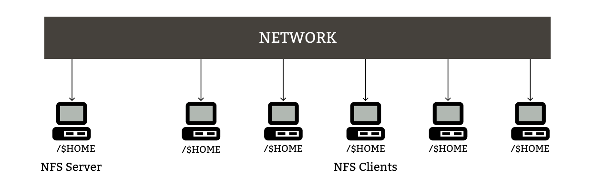
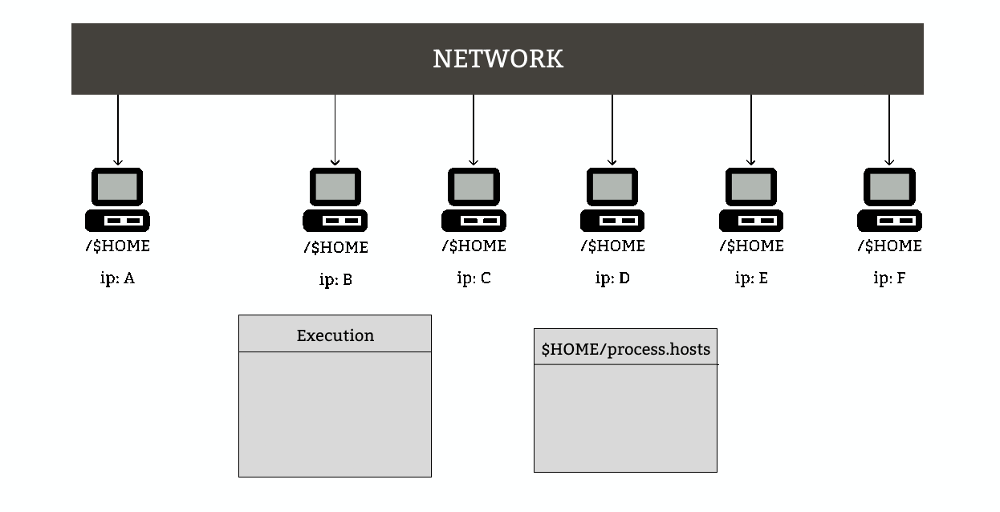

# Distributed Mutex Lock
### _A mutual exclusion C API for shared NFS mounted systems_

> NOTE: `dsm_lock_api` assumes that the API is being called by processes running on different Linux machines. It relies on the $HOME/process.hosts file to obtain machine IPs that are participating in the Lock/Unlock operations. The presence of a shared file system across these machines is recommended to ensure consistent access to the $HOME/process.hosts file.

## Features
- Plug and play API 🕹️✨
- Logs all background activity 🗒️
- Uses Lamport Scalar Clock ⏱️ for synchronization 
- Spawns a network thread 🧵 to receive incoming messages 👂🏼
- Performs background operations in a non-blocking manner 🟢
- Uses semaphores for blocking ⛔ when requesting for lock


- `dsm_init()` initializes 📦 the ds_lock structure
- `dsm_lock()` sends a REQUEST to all other hosts to acquire lock 🔒
- `dsm_lock()` blocks 🛑 the callee thread until every host sends a REPLY
- `dsm_unlock()` well 🤷🏻‍♂️ unlocks the acquired lock 🔓
- `dsm_destroy()` disposes the ds_lock structure 🗑️
## Usage
```c
#include "dsm_lock_api.h" // Include the API header file


int main(int argc, char *argv[]){
    ds_lock *ds_lck = malloc(sizeof(ds_lock)); //Initialize the ds_lock struct pointer

    dsm_lock(ds_lck); // Request for lock

    do_something(); // Perform operation on a shared resource

    dsm_unlock(ds_lck); // Remove the lock

    dsm_destroy(ds_lck); // Dispose the ds_lock struct pointer

    return 0;
}
```
## Compilation

Use the following command to compile `my_prog.c` which uses the `dsm_lock_api.c`.
```sh
$ gcc -o my_prog my_prog.c dsm_lock_api.c -lpthread
```
> Note: make sure to use `-lpthread` flag to link the pthread library
---
## More information

The system given below share the $HOME directory. The grey color indicate that the machines currently do not use the `dsm_lock_api`.

<center></center><br><br>

### *dsm_init()*
When a program calls the `dsm_init()` function the IP address of the current machine is added to the `$HOME/process.hosts` file. The blue machines means that other machines now know each other blue machine.

<center></center><br><br>

### *dsm_lock()*
#### Scenario 1:
Machine `C` calls the `dsm_lock()` function. A packet with type `REQUEST` is sent from machine `C` to `A`, `D`, `E` and machine `C` waits till a `REPLY` packet is received from every machine. 

<center></center><br>

### Scenario 2:
Now, if machine `C` currently holds the lock and machine `D` wants the lock, machine `D` simply sends a `REQUEST` packet to all other machines and waits till the `REPLY` packet is received.
> The following GIF shows that machine `C` does not send a `REPLY` packet until it releases the lock (using the `dsm_unlock()`).

<center></center><br>

### *dsm_destroy()* (Unimplemented: See issue [#3](https://github.com/Ansh743/distributed-mutex-lock/issues/3))
Remove the current machine's IP address and reorder the index also notify other hosts that a machine went offline.
<center></center><br>

